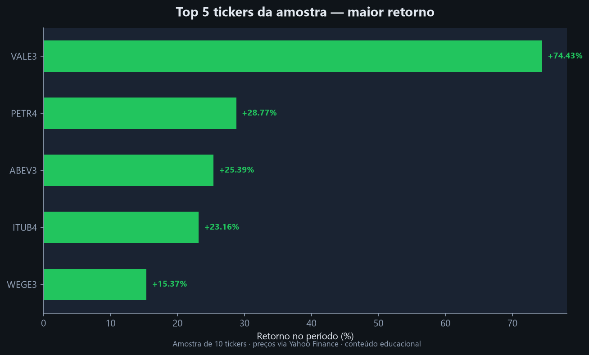
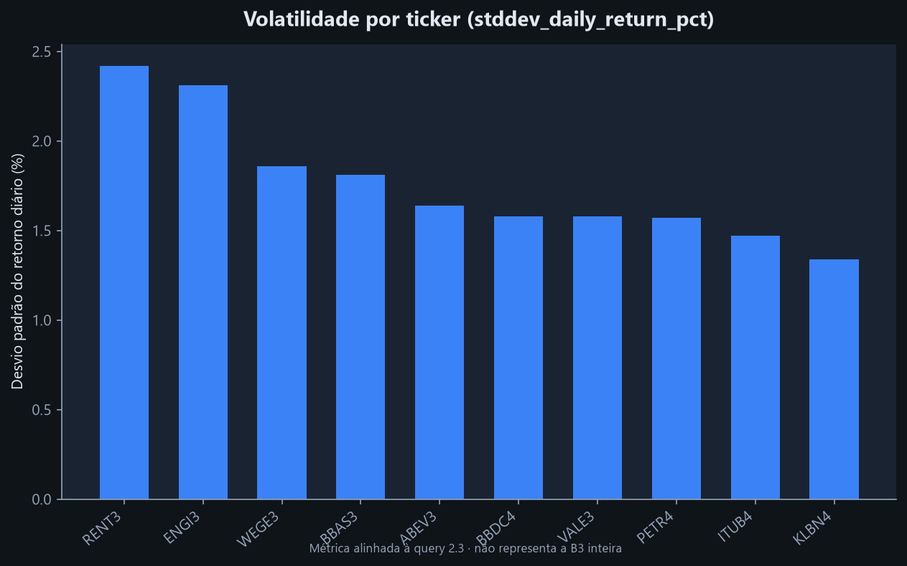
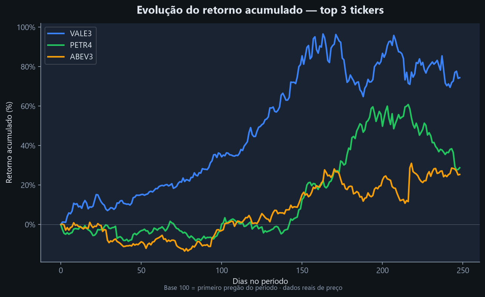
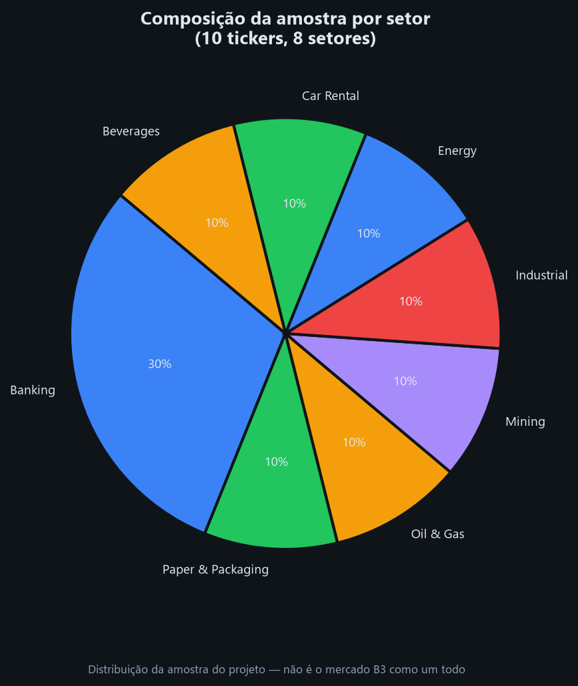
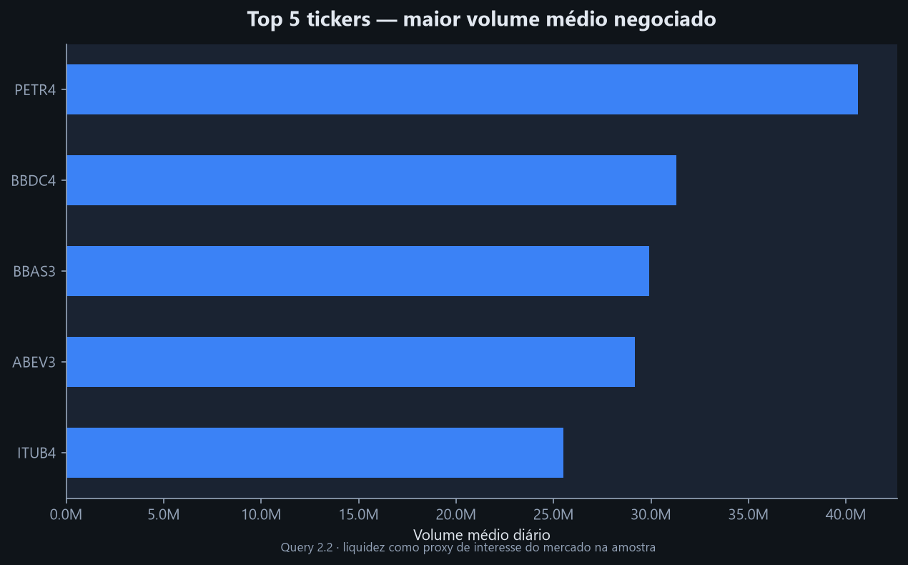

# B3 Financial Analysis

[](https://www.sqlite.org/)
[](https://www.python.org/)
[](https://github.com/dennerrmartins)
[](#)

**Análise SQL de uma amostra de tickers da B3 com dados reais de preço, ETL em Python e relatórios reprodutíveis.**

Portfólio profissional de **Denner Martins** — Dados, BI e Mercado Financeiro.

> **Aviso:** conteúdo educacional. **Não é recomendação de investimento.** Amostra de 10 tickers — não representa a B3 como um todo.

---

## O problema

Profissionais de dados e finanças precisam transformar dados de mercado em **análises reprodutíveis** — não em planilhas isoladas. Este projeto simula um fluxo real de trabalho:

1. Coletar e estruturar dados
2. Modelar em banco relacional
3. Responder perguntas de negócio com SQL
4. Documentar resultados e visualizações

## Contexto de negócio

A B3 concentra parte relevante do mercado de capitais brasileiro. Mesmo com uma **amostra reduzida de 10 tickers**, é possível praticar análises que recrutadores reconhecem: retorno, volatilidade, comparação por setor, séries temporais e indicadores financeiros.

O projeto conecta minha atuação em **controle de pagamentos, orçamento x realizado (DRE) e BI** com análise quantitativa aplicada a ativos listados.

## Objetivos da análise

- Construir pipeline reprodutível: **Yahoo Finance → SQLite → SQL → relatório**
- Demonstrar SQL do básico ao avançado (JOINs, CTEs, window functions)
- Gerar insights de mercado com **dados reais de preço**
- Documentar limitações e separar dados reais de dados ilustrativos
- Produzir material visual para portfólio (gráficos + case study)

---

## Business Questions Answered

| Pergunta de negócio | Onde está respondida |
|---------------------|----------------------|
| Quais tickers tiveram maior retorno no período? | Query 2.1 · gráfico `01_top_returns.png` |
| Quais tickers apresentaram maior volatilidade? | Query 2.3 (`stddev_daily_return_pct`) · gráfico `02_volatility.png` |
| Como comparar tickers por setor na amostra? | Queries 1.2, 4.3 · gráfico `04_sector_sample.png` |
| Quais empresas evoluem melhor nos indicadores analisados? | Módulo 03 *(dados ilustrativos)* |
| Como SQL gera análises financeiras reprodutíveis? | `run_queries.py` → `output/RESULTS.md` |

---

## Principais resultados

| Destaque | Valor *(amostra atual)* |
|----------|-------------------------|
| Maior retorno | VALE3 — ver relatório para % exato do período |
| Maior volatilidade | Ver query 2.3 no [RESULTS.md](output/RESULTS.md) |
| Base de preços | ~2.490 registros · 10 tickers |
| Queries documentadas | 20+ em 5 módulos SQL |

> Os percentuais variam conforme a data de execução do `create_database.py`. Consulte sempre o [relatório atualizado](output/RESULTS.md).

---

## Visualizações

| Gráfico | Descrição |
|---------|-----------|
|  | Ranking de retorno — top 5 tickers |
|  | Desvio padrão do retorno diário |
|  | Retorno acumulado — top 3 tickers |
|  | Composição da amostra por setor |
|  | Maior volume médio negociado |

*Execute `python generate_charts.py` para regenerar as imagens após atualizar o banco.*

---

## Habilidades demonstradas

| Área | Evidência no projeto |
|------|----------------------|
| **SQL** | 20+ queries, CTEs, window functions, agregações |
| **Python / ETL** | `create_database.py` — coleta via yfinance |
| **Modelagem** | 3 tabelas relacionadas (`stocks`, `daily_prices`, `financial_indicators`) |
| **Análise financeira** | Retorno, volatilidade, liquidez, ratios *(módulo 03 ilustrativo)* |
| **Storytelling** | `RESULTS.md`, gráficos, [case study](docs/case_study.md) |
| **Governança de dados** | Avisos, separação dado real vs. ilustrativo, amostra explícita |

---

## Dataset

| Tabela | Descrição | Fonte |
|--------|-----------|-------|
| `stocks` | 10 tickers e setores | Curadoria manual |
| `daily_prices` | ~1 ano de OHLCV | **Yahoo Finance** (dados reais) |
| `financial_indicators` | Receita, lucro, EBITDA, dívida (2022–2023) | **Ilustrativo** — prática de SQL |

### Tickers na amostra

| Ticker | Empresa | Setor |
|--------|---------|-------|
| PETR4 | Petrobras | Oil & Gas |
| VALE3 | Vale | Mining |
| ITUB4 | Itaú Unibanco | Banking |
| BBDC4 | Bradesco | Banking |
| ABEV3 | Ambev | Beverages |
| WEGE3 | WEG | Industrial |
| BBAS3 | Banco do Brasil | Banking |
| ENGI3 | Energisa | Energy |
| KLBN4 | Klabin | Paper & Packaging |
| RENT3 | Localiza | Car Rental |

---

## Como executar

**Pré-requisitos:** Python 3.10+, pip

```bash
git clone https://github.com/dennerrmartins/b3-financial-analysis.git
cd b3-financial-analysis
pip install -r requirements.txt

python create_database.py    # 1. Baixa dados e cria o SQLite
python run_queries.py        # 2. Gera output/RESULTS.md
python generate_charts.py    # 3. Gera assets/charts/*.png
```

O arquivo `database/b3_stocks.db` é gerado localmente (gitignored).

---

## Estrutura do projeto

```
b3-financial-analysis/
├── README.md
├── requirements.txt
├── create_database.py       # ETL: Yahoo Finance → SQLite
├── run_queries.py           # Executa SQL → RESULTS.md
├── generate_charts.py         # Gera gráficos PNG
├── queries/                   # 5 módulos SQL
├── output/
│   └── RESULTS.md           # Relatório completo
├── assets/
│   └── charts/              # Visualizações para README
├── docs/
│   └── case_study.md        # Mini case de negócio
└── database/                # Gerado localmente (.gitignore)
```

---

## Módulos SQL

| Arquivo | Tema | Skills |
|---------|------|--------|
| [01_exploring_data.sql](queries/01_exploring_data.sql) | Exploração | SELECT, WHERE, GROUP BY, subqueries |
| [02_top_performers.sql](queries/02_top_performers.sql) | Performance | CTEs, JOINs, stddev de retorno |
| [03_financial_health.sql](queries/03_financial_health.sql) | Indicadores | JOINs, self-joins, ratios *(ilustrativo)* |
| [04_window_functions.sql](queries/04_window_functions.sql) | Séries temporais | LAG, AVG OVER, RANK, FIRST_VALUE |
| [05_challenge_queries.sql](queries/05_challenge_queries.sql) | Desafio | ROW_NUMBER, CTEs complexas |

---

## Aplicações práticas

As competências exercitadas neste projeto se aplicam a cenários reais de trabalho e projetos freelance:

- Dashboards financeiros e relatórios automatizados (Power BI / Looker)
- Controle e acompanhamento de carteira ou indicadores de performance
- Pipelines simples de dados para pequenos negócios
- Organização de bases para tomada de decisão (DRE, orçamento x realizado)
- Análises ad hoc reprodutíveis para áreas de risco, crédito e operações

---

## Documentação adicional

- [Relatório de resultados](output/RESULTS.md)
- [Case study](docs/case_study.md)

---

## Sobre o autor

**Denner Martins** — Dados, BI e Finanças

Graduando em Economia (UERJ). Atua com dashboards, automação de dados, controle de pagamentos e análise de orçamento x realizado na DRE. Interesse em oportunidades em **Dados, BI, Mercado Financeiro, Risco, Crédito e Fintechs**.

[](https://linkedin.com/in/dennermartins)
[](https://github.com/dennerrmartins)
[](mailto:denner.rmartins@gmail.com)

---

*Projeto de portfólio — análise educacional, sem recomendação de investimento.*
